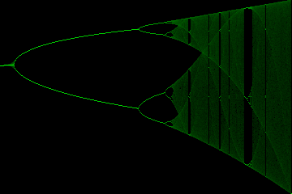
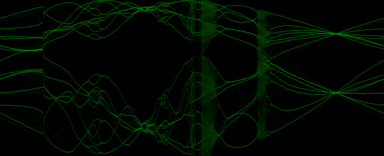

# logistical_nightmares
Dark Ambient Sonic Abuse of the Logistic Map

The [bifurcation diagram](https://en.wikipedia.org/wiki/Bifurcation_diagram) of the [Logistic Map](https://en.wikipedia.org/wiki/Logistic_map) as
[popularised by Robert May](https://www.researchgate.net/publication/237005499_Simple_Mathematical_Models_With_Very_Complicated_Dynamics) somewhat
lacks variety compared to some [other chaotic maps](https://en.wikipedia.org/wiki/List_of_chaotic_maps).

If we take the recurrance relation

$$\Large{x_{n+1}=rx_{n}}(1-x_{n})$$

we can replace the single coefficient $r$ varied across the horizontal axis with some repeating sequence of two coefficients $A$ and $B$.
(This has been used to generate [Lyapunov fractals](https://en.wikipedia.org/wiki/Lyapunov_fractal).)
For example, the sequence $ABAABBB$, where $A$ and $B$ are described by the points on a circle of radius 0.25 centred on (3.28, 3.28) looks
like:

One can treat each histogram column in a bifurcation diagram as a spectrum. By taking
[inverse discrete cosine transforms](https://en.wikipedia.org/wiki/Discrete_cosine_transform#Inverse_transforms)
of the spectra, multiplying by a
[window function](https://docs.scipy.org/doc/scipy/reference/generated/scipy.signal.windows.blackmanharris.html)
and summing the signals after overlapping them by a [hop-size](https://en.wikipedia.org/wiki/Short-time_Fourier_transform),
an audio loop can be *perpetrated*. We can add two extra coefficients, $C$ and $D$ which also rotate, to produce a sequence
of image that might look and sound something like [this](https://youtu.be/CvHFb1de2Vs?feature=shared).
